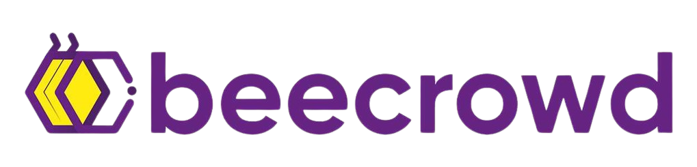

---
# Introduction
This repository contains solutions to various Beecrowd exercises in multiple programming languages. The exercises are organized into folders based on the programming language used and the category.

The exercise have nine categorys:
- 1. Iniciante (Beginner)
- 2. Ad-Hoc
- 3. Strings
- 4. Estruturas e Bibliotecas (Structures and Librarys)
- 5. Matemática (Mathematics)
- 6. Paradigmas (Paradigms)
- 7. Grafos (Graphs)
- 8. Geometria Computacional (Computational Geometry)
- 9. SQL

Notice that's a brazilian repository, so some files and variables probably it's using the name in brazilian portuguese. 

---

# General Progress

